<div align="center">


</div>

<div align="center">

[](https://git.io/typing-svg)

</div>
## 🛠️ When I code, I rely on

### 🌐 Frontend


### ⚙️ Backend


### 🗄️ Database & Infrastructure


### 🤖 AI / ML & GenAI


### 📱 Mobile


### 🧰 Tools & Platforms


---
---

## 🧑‍💻 About Me

```ts
const mayank = {
  alias      : "calmcode47",
  role       : "Full-Stack · AI/ML · Mobile Developer",
  focus      : ["Web Dev", "Mobile Dev", "AI/ML", "Generative AI", "Browser Tools"],
  philosophy : "Ship fast. Learn faster. Break nothing in prod.",
  funFact    : "I name my side projects like startups 🚀",
};
```

- 🤖 Building real-world products powered by **Anthropic Claude**, **Gemini**, and **Imagen**
- 📱 Shipped cross-platform apps on **Android & iOS** with React Native + Expo
- 🌐 Crafting full-stack apps with **Next.js 15**, **FastAPI**, and **Supabase**
- ⚡ Obsessed with **performance, scalability, and beautiful UX**
- 🏆 Active **hackathon competitor** — always building under pressure

---

## 🚀 Featured Projects

<table>
<tr>
<td width="50%" valign="top">

### 🏥 MediQR
**QR-Based Universal Digital Health Identity**

Next-gen healthcare platform where every patient gets a QR-linked medical identity. Role-based dashboards for patients, doctors, paramedics & admins with AI-powered drug interaction checking.

**Stack:** `Next.js 15` · `FastAPI` · `Supabase` · `Claude 3.5 Sonnet` · `Redis`

✅ Real-time notifications · immutable audit trails · emergency portal

---

### 🎤 [VoiceShield AI](https://github.com/calmcode47/Ai-Voice-Detector)
**AI-Generated Voice Detection API**

Detects whether audio is AI-generated or human. Supports English, Hindi, Tamil, Telugu & Malayalam with confidence scoring.

**Stack:** `Python` · `FastAPI` · `ML Models` · `React 19` · `Three.js`

</td>
<td width="50%" valign="top">

### 💄 [Glowverse](https://github.com/calmcode47/Glowverse-app)
**AI + AR Beauty & Skincare Mobile App**

Cross-platform mobile app with AR virtual try-on, AI skin analysis, and hyper-personalized recommendations. Shipped on Android & iOS.

**Stack:** `React Native` · `Expo` · `TypeScript` · `AI/ML APIs`

✅ Virtual try-on · skin analysis · personalized recs

---

### 🌱 [GreenTrack](https://github.com/calmcode47/GreenTrack)
**AI Eco-Lifestyle & Carbon Footprint Tracker**

Gamified sustainability platform with AI-powered insights and a global eco-community.

**Stack:** `TypeScript` · `Next.js` · `AI insights` · `Gamification`

</td>
</tr>
<tr>
<td width="50%" valign="top">

### 🌐 [ContextPilot](https://github.com/calmcode47/Contextpilot)
**AI-Powered Chrome Extension**

Smart browser side panel that understands the active page — summarizes content, drafts emails, fills forms, and answers questions in context.

**Stack:** `JavaScript` · `Chrome Extension APIs` · `LLM Integration`

</td>
<td width="50%" valign="top">

### 🎬 PitchForge
**AI Creative Director for Marketing Campaigns**

Generates full multimodal marketing campaigns via SSE streaming. Google AI Agent Hackathon submission.

**Stack:** `FastAPI` · `Gemini 2.0 Flash` · `Imagen 3` · `Veo 2` · `React` · `Cloud Run`

</td>
</tr>
</table>

---

## 📊 My GitHub Stats

<div align="center">




</div>

<div align="center">



</div>

---

## 📬 Let's Connect

<div align="center">

[](https://github.com/calmcode47)
[](https://www.linkedin.com/in/mayank-joshi-3bb8a0366/)
[](mailto:your@email.com)

</div>

---

<div align="center">


**⭐ If you find my work useful, drop a star — it genuinely motivates me to keep building!**

</div>
